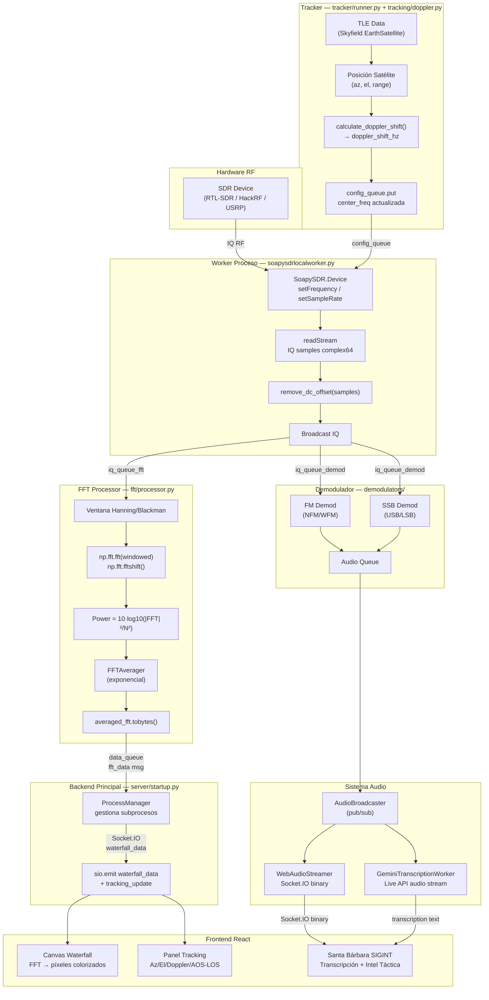

# ARQUITECTURA_ANALISIS.md — Santa Bárbara Prototipo v5
## Basado en ground-station v0.4.7 (sgoudelis/ground-station)

---

## 1. Árbol de Directorios y Descripción Funcional

```
ground-station/
├── backend/                          # Servidor Python/FastAPI
│   ├── app.py                        # Punto de entrada principal: inicia uvicorn, registra señales UNIX
│   ├── server/
│   │   ├── startup.py                # Crea app FastAPI, configura middleware, lifespan, rutas estáticas
│   │   ├── runtimestate.py           # Estado global compartido (audio_queue, process_manager, etc.)
│   │   ├── scheduler.py              # APScheduler: genera y lanza observaciones programadas
│   │   ├── systeminfo.py             # Emite métricas de sistema (CPU, memoria) por Socket.IO
│   │   └── shutdown.py              # Limpiezas al terminar (audio, procesos, streams)
│   ├── pipeline/
│   │   ├── orchestration/
│   │   │   └── processmanager.py     # Orquesta workers SDR como subprocesos; gestiona colas IPC
│   │   ├── managers/                 # Gestores de demodulación y FFT por sesión
│   │   ├── registries/               # Registro de tipos de demoduladores disponibles
│   │   └── streaming/                # Streaming de datos IQ a consumidores
│   ├── workers/
│   │   ├── soapysdrlocalworker.py    # Worker proceso separado: adquiere IQ de SDR local (SoapySDR)
│   │   ├── soapysdrremoteworker.py   # Worker para SDR remoto vía red
│   │   ├── rtlsdrworker.py           # Worker específico RTL-SDR (rtl_tcp)
│   │   ├── sigmfplaybackworker.py    # Reproduce archivos SigMF (mock/offline)
│   │   └── uhdworker.py              # Worker para dispositivos USRP (UHD)
│   ├── fft/
│   │   ├── processor.py              # Proceso separado: calcula FFT/Welch sobre muestras IQ, envía waterfall
│   │   ├── averager.py               # Promediador temporal de resultados FFT
│   │   └── waterfallgenerator.py     # Convierte FFT a imagen PNG para grabaciones
│   ├── tracking/
│   │   ├── doppler.py                # Calcula corrección Doppler usando skyfield + TLE
│   │   ├── satellite.py              # Posición y velocidad de satélite en tiempo real
│   │   ├── passes.py                 # Calcula pases de satélite (AOS/LOS)
│   │   └── footprint.py              # Calcula huella de cobertura del satélite en tierra
│   ├── tracker/
│   │   ├── runner.py                 # Bucle principal del tracker: actualiza posición cada ciclo
│   │   ├── logic.py                  # Lógica de tracking: cuándo ajustar frecuencia Doppler
│   │   ├── manager.py                # Gestiona múltiples instancias de tracker simultáneas
│   │   └── ipc.py                    # IPC entre tracker y proceso SDR (cola de configuración)
│   ├── demodulators/
│   │   ├── fmdemodulator.py          # Demodulador FM (WFM/NFM)
│   │   ├── ssbdemodulator.py         # Demodulador SSB (USB/LSB) — relevante para voz táctica HF
│   │   ├── bpskdecoder.py            # Decodificador BPSK (satélites cubesat)
│   │   ├── fskdecoder.py             # Decodificador FSK
│   │   └── amdemodulator.py          # Demodulador AM
│   ├── audio/
│   │   ├── geminitranscriptionworker.py  # Transcripción de audio en tiempo real con Gemini Live API
│   │   ├── audiobroadcaster.py           # Distribuye audio a múltiples consumidores (pub/sub)
│   │   └── audiostreamer.py              # Streaming de audio al frontend por Socket.IO
│   ├── celestial/
│   │   ├── scene.py                  # Escena 3D del sistema solar; posiciones cuerpos celestes
│   │   └── observermath.py           # Matemáticas de observación astronómica (horizonte, elevación)
│   ├── crud/                         # Acceso a datos (SQLAlchemy async): satélites, hardware, TLEs, etc.
│   ├── db/
│   │   ├── models.py                 # Modelos ORM: Satellite, Hardware, Location, Observation, etc.
│   │   └── migrations.py             # Alembic: aplica migraciones de esquema al inicio
│   ├── observations/
│   │   ├── executor.py               # Ejecuta observaciones programadas (inicia pipeline SDR)
│   │   └── generator.py              # Genera ventanas de observación futura a partir de pases
│   ├── handlers/                     # Handlers Socket.IO: procesan eventos del frontend
│   ├── telemetry/                    # Parsers de telemetría: AX.25, CCSDS, CSP
│   ├── common/
│   │   ├── sdrconfig.py              # Dataclasses de configuración SDR (frecuencia, ganancia, etc.)
│   │   ├── logger.py                 # Configuración centralizada de logging rotativo
│   │   └── auth.py                   # Autenticación JWT (usuarios de la plataforma civil)
│   ├── santa_barbara/                # [NUEVO] Módulo táctico Santa Bárbara v5
│   │   ├── __init__.py
│   │   ├── api.py                    # Router FastAPI /api/v5/santa_barbara
│   │   ├── auth.py                   # Autenticación táctica X-API-Key
│   │   ├── signal_handler.py         # Wrapper al core de tracking/adquisición
│   │   └── config.py                 # Configuración del módulo táctico
│   └── requirements.txt              # Dependencias Python del backend
├── frontend/                         # SPA React (Vite + MUI Toolpad)
│   ├── src/
│   │   ├── App.jsx                   # Componente raíz: proveedores de contexto, tema, socket
│   │   ├── main.jsx                  # Entrada Vite: monta App, configura Redux store y rutas
│   │   ├── config/
│   │   │   ├── navigation.jsx        # Define el menú lateral (segmentos → rutas → iconos)
│   │   │   └── branding.jsx          # Logo y nombre de la aplicación
│   │   ├── components/
│   │   │   ├── waterfall/            # Visualización waterfall FFT en canvas + control VFO
│   │   │   ├── dashboard/            # Panel de tracking de satélites (AOS/LOS, elevación, mapa)
│   │   │   ├── common/               # Socket.IO hook, custom icons, diálogos compartidos
│   │   │   └── santa-barbara/        # [NUEVO] Componente SIGINT táctico
│   │   ├── themes/
│   │   │   └── ares-tactical-theme.css  # [NUEVO] HUD táctico Ares OS
│   │   └── theme.js                  # Configuración de tema MUI (claro/oscuro/auto)
│   └── package.json                  # Dependencias Node.js
├── start_santa_barbara.sh            # [NUEVO] Script de arranque nativo Ares OS
├── DEPENDENCIAS_ARES.md              # [NUEVO] Guía de instalación nativa Arch/Ares OS
├── TACTICAL_THEME.md                 # [NUEVO] Guía del tema táctico
└── ARQUITECTURA_ANALISIS.md          # Este archivo
```

---

## 2. Tecnologías Clave e Interconexión

| Capa | Tecnología | Rol |
|------|-----------|-----|
| **Adquisición RF** | SoapySDR / RTL-SDR / HackRF / USRP | Captura muestras IQ del espectro de radio |
| **Procesado de señal** | NumPy, SciPy | FFT, ventanas, promediado, demodulación |
| **Tracking orbital** | Skyfield, SGP4 | Propagación TLE → posición satélite → corrección Doppler |
| **Backend API** | FastAPI + uvicorn | API REST + WebSocket; gestión de observaciones y hardware |
| **Mensajería RT** | Socket.IO (python-socketio) | Push de waterfall FFT, estado de tracking, audio al frontend |
| **Gestión de procesos** | Python multiprocessing | Workers SDR/FFT/demod en procesos separados (aislamiento) |
| **Tareas diferidas** | APScheduler | Ejecución de observaciones programadas por ventana AOS/LOS |
| **Persistencia** | SQLite + SQLAlchemy async | Satélites, TLEs, hardware, preferencias, observaciones |
| **Migraciones** | Alembic | Control de versiones del esquema de BD |
| **Frontend** | React 18 + Vite | SPA de un solo archivo; canvas para waterfall |
| **UI components** | MUI Toolpad Core | Shell con navegación lateral, temas Material |
| **Estado global** | Redux Toolkit | Slices para waterfall, tracking, scheduler, preferencias |
| **Transcripción** | Google Gemini Live API | Audio → texto en tiempo real (WebRTC audio stream) |
| **SIGINT táctico** | Gemini (sistema prompt SIGINT) | Extrae coordenadas MGRS, llamadas de fuego, palabras clave |

### Flujo de interconexión simplificado:

```
SDR Hardware → SoapySDRWorker (proceso) → IQ Queue → FFT Processor (proceso)
                                        ↘ Demod Queue → Demodulator (proceso) → Audio → Gemini
FFT Processor → data_queue → ProcessManager → Socket.IO → Frontend Canvas (waterfall)
Tracker (skyfield TLE) → Doppler correction → SDR config_queue (actualiza frecuencia)
```

---

## 3. Diagrama de Flujo Mermaid: Adquisición SDR → Procesado → Frontend



---

## 4. Los 5 Archivos Más Críticos para Adquisición y Procesado de Señales

### 1. `backend/workers/soapysdrlocalworker.py`
**Rol:** Proceso separado que controla físicamente el hardware SDR. Es el único punto de contacto con el dispositivo RF. Gestiona la configuración dinámica (frecuencia, ganancia, tasa de muestreo) mediante una `config_queue` (multiprocessing). Produce bloques de muestras IQ `complex64` y los distribuye a dos colas: `iq_queue_fft` (para visualización waterfall) y `iq_queue_demod` (para demodulación/audio). Implementa corrección DC y control de flujo con backpressure.

### 2. `backend/fft/processor.py`
**Rol:** Proceso independiente que consume muestras IQ y produce resultados FFT. Implementa ventanado (Hanning, Blackman, etc.), FFT con shift DC al centro, normalización de potencia (`10·log10`), promediado temporal exponencial y solapamiento configurable. Envía resultados serializados como `float32` bytes a la cola principal, que los retransmite por Socket.IO al canvas del frontend.

### 3. `backend/tracking/doppler.py`
**Rol:** Calcula la corrección Doppler en tiempo real usando `skyfield`. A partir de las líneas TLE del satélite y la posición del observador, computa la velocidad radial (dot product del vector de posición unitario con el vector velocidad topocéntrico), aplica el factor Doppler relativista y devuelve la frecuencia corregida. Este valor se inyecta como `center_freq` en la `config_queue` del worker SDR, cerrando el lazo de seguimiento en frecuencia.

### 4. `backend/tracker/runner.py`
**Rol:** Bucle de control del tracker. Corre en un hilo dedicado, actualiza la posición del satélite periódicamente (cada ≈1s), invoca `doppler.py` para calcular la nueva frecuencia, compara con la anterior y —si supera el umbral de cambio— envía la nueva configuración al worker SDR. También actualiza el estado (az/el/range/AOS/LOS) que se emite por Socket.IO al frontend para la visualización del tracking console.

### 5. `backend/server/startup.py`
**Rol:** Corazón del servidor. Crea la instancia `FastAPI`, configura middleware CORS, monta rutas estáticas, inicializa el sistema de audio con pub/sub, arranca el `ProcessManager`, el `ObservationExecutor`, el scheduler APScheduler y todos los emitters de estado por Socket.IO. Es el fichero de bootstrap que debe modificarse para integrar el router de Santa Bárbara sin romper el core civil.

---

## 5. Resumen de Dependencias de Integración Santa Bárbara

```
backend/santa_barbara/api.py
    → import backend/santa_barbara/auth.py       (validación X-API-Key)
    → import backend/santa_barbara/signal_handler.py  (acceso al core de tracking)
    → import backend/santa_barbara/config.py     (clave API, parámetros tácticos)
    ↗ registrado en backend/server/startup.py    (app.include_router)

frontend/src/components/santa-barbara/SantaBarbaraTacticalComms.jsx
    → conectado en frontend/src/config/navigation.jsx  (entrada menú lateral)
    → ruta en frontend/src/main.jsx               (React Router segment 'santa-barbara')

start_santa_barbara.sh
    → arranca: Redis (si no corre), uvicorn backend, vite frontend, workers GNU Radio
    → detecta SDR hardware o usa sigmfplaybackworker como mock
```

---
*Documento generado para Santa Bárbara Prototipo v5 — Ares OS — 2026-05-11*
