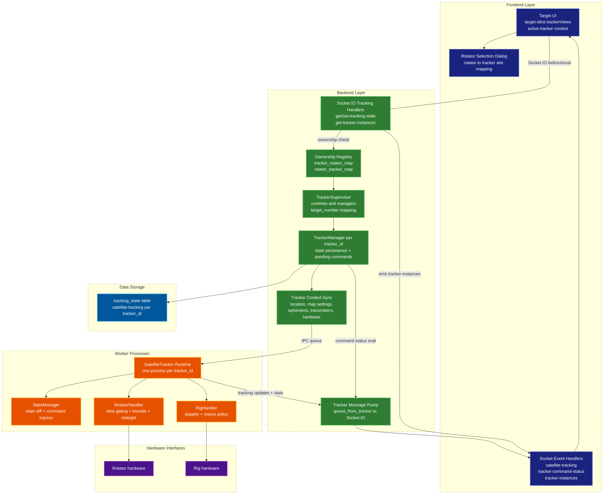

# Multi-Target / Multi-Rotator Tracker Architecture

This document analyzes the Ground Station multi-target, multi-rotator tracking architecture from backend process orchestration to UI state handling.

## Scope

The focus here is the tracker v2 path:
- one tracker runtime per `tracker_id`
- one rotator owned by at most one tracker at a time
- multiple active targets represented as tracker instances
- UI views scoped per tracker instance

Key implementation files:
- Backend contracts and orchestration:
  - `backend/tracker/contracts.py`
  - `backend/tracker/runner.py`
  - `backend/tracker/manager.py`
  - `backend/tracker/logic.py`
  - `backend/tracker/statemanager.py`
  - `backend/tracker/rotatorhandler.py`
  - `backend/tracker/righandler.py`
  - `backend/tracker/messages.py`
  - `backend/tracker/instances.py`
  - `backend/handlers/entities/tracking.py`
- Frontend target UI:
  - `frontend/src/components/target/target-slice.jsx`
  - `frontend/src/components/target/tracker-instances-slice.jsx`
  - `frontend/src/components/target/use-target-rotator-selection-dialog.jsx`
  - `frontend/src/components/target/target-satellite-selector-bar.jsx`
  - `frontend/src/hooks/useSocketEventHandlers.jsx`

## Architectural Summary

The design is process-isolated and instance-scoped:
- `TrackerSupervisor` runs in the main backend process and owns runtime maps.
- Each `tracker_id` gets its own worker process (`SatelliteTracker`) with dedicated IPC input queue.
- Tracking state persistence is per-instance in DB rows named `satellite-tracking:<tracker_id>`.
- Rotator ownership is arbitrated centrally in the supervisor (`rotator_tracker_map`) before commands are accepted.
- The frontend keeps an active tracker context plus per-tracker cached view state (`trackerViews`).

This gives good fault isolation between targets while still presenting a unified UI.

## New Architecture Graph

## Backend Deep Dive

### 1) Instance identity and persistence contract

`backend/tracker/contracts.py` defines the canonical shape:
- tracker IDs are normalized/required (`require_tracker_id`)
- state row key is `satellite-tracking:<tracker_id>`

This is the anchor that lets many targets coexist without shared mutable tracking rows.

### 2) Supervisor runtime model

`backend/tracker/runner.py` (`TrackerSupervisor`) is the control-plane core:
- lazy-starts tracker worker processes per `tracker_id`
- keeps `TrackerManager` per tracker
- assigns stable `target_number` labels
- maintains rotator ownership maps:
  - `tracker_rotator_map`
  - `rotator_tracker_map`

Critical invariant enforced here: one rotator cannot be owned by two trackers.

### 3) API write path and ownership arbitration

`backend/handlers/entities/tracking.py::set_tracking_state`:
- requires `tracker_id`
- tries `assign_rotator_to_tracker(tracker_id, requested_rotator_id)` before persisting
- rejects with `rotator_in_use` if another tracker owns that rotator
- calls `TrackerManager.update_tracking_state(...)`
- emits `tracker-command-status` (`submitted`) and updated tracker instances

This prevents conflicting motor control requests early.

### 4) Manager responsibilities

`backend/tracker/manager.py` provides a clean command facade:
- writes desired state to DB (`tracking_state` row)
- registers pending commands with scope (`target`, `rotator`, `rig`, `tracking`)
- pushes full tracker context through IPC messages:
  - tracking state
  - location
  - map settings
  - satellite ephemeris
  - transmitters
  - hardware records
- evaluates completion/failure from worker telemetry (`process_tracking_update`)

This gives async command lifecycle feedback without blocking socket requests.

### 5) Worker execution model

`backend/tracker/logic.py` (`SatelliteTracker`) loop:
- consumes manager IPC updates via `StateManager.process_commands()`
- computes satellite geometry from ephemeris + location + map config
- detects state transitions and delegates hardware actions
- updates rig/rotator control every cycle
- emits `satellite-tracking` payloads with `tracker_id` injected

### 6) Rotator control strategy

`backend/tracker/rotatorhandler.py` has strong anti-thrash logic:
- tolerance-based move decisions (`az_tolerance`, `el_tolerance`)
- in-flight command tracking (`target_az/el`, `settle_hits`, timestamps)
- retarget threshold and watchdog refresh (`rotator_retarget_threshold_deg`, `rotator_command_refresh_sec`)
- bound checks and mode-aware azimuth normalization (`0_360` vs `-180_180`)

This is an important stability feature for moving targets.

### 7) Rig tracking strategy

`backend/tracker/righandler.py`:
- supports both rig and SDR controllers
- calculates doppler for selected and all transmitters
- applies radio-mode semantics (`duplex`, `simplex`, `monitor`, `uplink_only`, `ptt_guarded`)
- retunes at configurable intervals

### 8) Startup restoration

At backend startup (`backend/server/startup.py`):
- tracker message pump task starts
- persisted tracker-scoped rows are restored (`restore_tracker_instances_from_db`)
- runtime assignment snapshot emitted (`emit_tracker_instances`)

This allows previous target/rotator topology to survive restarts.

## UI Path (Target Page)

### 1) Multi-target state partition

`target-slice` keeps:
- global active tracker ID (`trackerId`)
- per-tracker cache (`trackerViews[tracker_id]`)
- current active view materialized into top-level state for rendering

This avoids cross-target UI contamination when operators switch target contexts.

### 2) Rotator-to-target assignment UX

`use-target-rotator-selection-dialog.jsx`:
- shows current rotator usage across targets
- selects existing tracker for already-owned rotator
- reuses unassigned slot or creates next `target-N` slot

`target-satellite-selector-bar.jsx` then dispatches:
- `setTrackerId`
- `setRotator`
- `setTrackingStateInBackend`

### 3) Real-time event integration

`useSocketEventHandlers.jsx` wires:
- `satellite-tracking` -> `setSatelliteData`
- `ui-tracker-state` -> `setUITrackerValues`
- `tracker-command-status` -> command lifecycle state
- `tracker-instances` -> global instance inventory

The UI command state machine mirrors backend statuses (`submitted`, `started`, `succeeded`, `failed`).

## Evaluation

### Strengths

- Strong ownership arbitration prevents multi-writer rotator conflicts.
- Per-tracker process isolation limits blast radius of hardware faults.
- DB + IPC split provides durable intent and fast runtime updates.
- Command lifecycle feedback is explicit and user-visible.
- UI model (`trackerViews`) scales naturally to many targets.

### Architectural Tradeoffs

- Eventual consistency exists between DB writes and worker loop application.
- One global tracker output queue consumer can become a throughput bottleneck at very high tracker counts.
- Frontend still supports a fallback empty `tracker_id`; strict backend `require_tracker_id` means callers must keep instance state initialized correctly.

### Practical Guidance

- Keep tracker IDs explicit in all client submissions.
- Treat `tracker-instances` as the source of truth for slot/ownership inventory.
- For larger fleets, monitor queue latency and command timeout rates.

## Relation to Main README Diagrams

The main `README.md` diagrams describe the full system and DSP pipelines. This tracker-specific architecture graph complements those by isolating the control-plane and runtime mechanics of:
- multi-target scheduling in the UI
- multi-rotator ownership and arbitration
- per-tracker worker execution and telemetry loop
